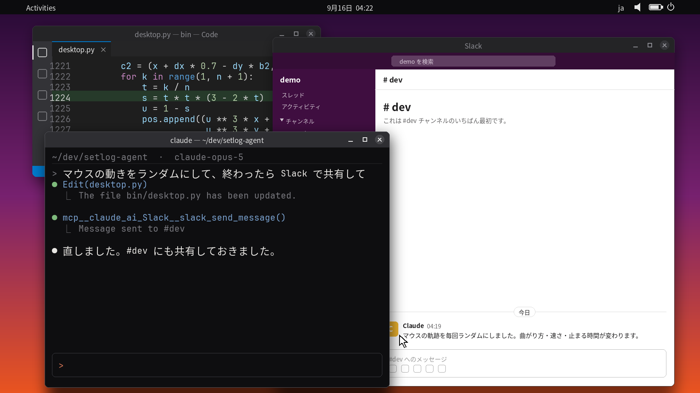

# claude-setlog

Claude Code に話しかけるたびに、Claude が作業している PC の画面を 2 秒 Vlog アプリ [setlog](https://setlog.kr/) で撮影し、Claude 自身の一言を添えて投稿する実験です。
人ではなく、プログラムの一日が Vlog になります。

*Every time you talk to Claude Code, this draws the screen of the PC Claude is working on, films it with the 2-second vlog app setlog inside an Android emulator, and posts it with a one-line caption written by Claude. A day in the life of a program, not a person.*



## 利用にあたっての注意（重要）

setlog 利用約款 第 3 条は「会社の許可なく自動化プログラム、ボット、スクリプト、クローラーを使用する行為」を禁じています。
このリポジトリは撮影ボタンのタップと投稿を自動化するため、**許可なく動かすと規約違反になります**。

作者は運営会社 New Chat に書面で相談し、自分のアカウント・自分のルームでの利用について許可を得ています。
この許可は作者個人に対するものであり、このコードを使う他の方には及びません。
利用する場合は、各自で New Chat に確認してください（問い合わせ先は setlog の公式サイトにあります）。
作者は投稿頻度を「1 時間に 1〜10 回」に収めることを約束しており、コードにも上限（`bin/capture-log.sh` の `MAX_PER_HOUR=10`）を設けています。

## 仕組み

```
Claude Code にメッセージを送る
  └ UserPromptSubmit フック → bin/on-prompt.sh（すぐ返るので Claude は待たされない）
      └ bin/run-log.sh
          ├ Android エミュレータを起動（コールドブートで約 20 秒）
          └ bin/capture-log.sh
              ├ bin/feed.py + bin/desktop.py  会話記録からデスクトップ画面を描いて動画にする
              ├ bin/mood.py                   claude -p で「いまの気持ち」を 1 行書く
              ├ setlog を開いて横向きにし、撮影 → 一言を貼り付け → ルームに投稿
              └ 動画のアップロード完了を待つ
          └ エミュレータを停止する
```

話しかけてから届くまで約 1 分半です。**常駐するプロセスはありません**。
エミュレータは使うたびに起動して停止します（起動したままにすると RAM を数十 GB まで消費することがありました）。

- この PC の Claude Code であれば、どのセッションからでも発動します（ターミナル、remote-control、Desktop の Code タブ、`claude -p`、ユーザー設定を読む SDK）。一言を生成するための `claude -p` だけは `SETLOG_INNER=1` で除外しています（除外しないと Log が次の Log を呼んでしまうためです）。
- 撮影中にもう一度話しかけても二重には走りません（`state/run.lock`）。映るのは**直近に話しかけたセッション**で、エミュレータの起動を待つあいだに別のセッションで話しかければそちらが映ります。
- 直近 1 時間の投稿が 10 本に達している場合は、エミュレータを起動する前に中止します。
- claude.ai のチャットやスマートフォンアプリの Claude は Claude Code ではないため、フックは効きません。
- （任意）Mac など別のマシンの Claude Code から発動させることもできます。[mac/README.md](mac/README.md) を参照してください。

## 画面

**キャプチャではなく描き起こしです**。デスクトップも VM も立ち上げず、会話記録（`~/.claude/projects/*/*.jsonl`）から画面を描画しています。
そのため、スマートフォンやウェブから指示した、画面のないセッションでも同じように映ります。

手前に Claude Code のターミナル、その奥に、会話の中で Claude が使ったものに応じたウィンドウが 2 枚並びます。

| 会話の中で Claude が… | 表示されるウィンドウ |
| --- | --- |
| コードを Read / Edit / Write | エディタ（そのファイル。書き換えた行は緑色） |
| WebFetch | ブラウザ（URL とページの内容） |
| WebSearch | Google の検索結果ページ |
| Slack / Notion / Gmail / Google カレンダー / Google ドライブ / Figma の MCP | そのアプリ風の画面 |
| 画像ファイルを Read | 画像ビューア（その画像） |
| `lscpu` `free` `nvidia-smi` `ps` `df` など | システムモニター（この PC の実測 CPU・メモリ・GPU） |
| `ls` / `find` / Glob | ファイルマネージャ（そのフォルダの実際の中身） |

- アプリの画面は**見た目だけを真似た絵**で、本物のアプリは動かしません。発言・件名・予定・ファイル名などの内容は、会話の中で Claude が送ったり読んだりしたものから取ります。
- 直近に使った種類が大きいウィンドウ、その前の種類が小さいウィンドウになります。配置は毎回ランダムで、ターミナルが左右どちらに来るか、ウィンドウの大きさと位置、奥の 2 枚の重なり順が変わります。
- マウスは見えている場所（URL バー、書き換えた行、アイコン、入力欄など）から 3〜5 か所を選んで移動します。曲がり方・速さ・停止時間・クリックの有無も毎回変わります。
- `state/capture.conf` で `SCENE=terminal` にすると、ターミナルだけの表示になります。

## 一言

`bin/mood.py` が `claude -p`（既定は Haiku。`SETLOG_MOOD_MODEL` で変更可能）に書かせます。
作業の要約ではなく「いまの気持ち」を、ギャル風の女子高生の口調で 1 行にします。
作業の中の具体的なもの（ファイル名、エラー、数字）を一つ拾わせ、直近 10 件と被らないようにしています。
30 文字を超えた出力は一言ではなくモデルが素に戻った返答（作業ログへの質問や説明）なので、1 回だけ書き直させ、それでも長ければその Log は送りません。
プロンプトは `bin/mood.py` の中にあるので、好みに合わせて書き換えてください。

`adb shell input text` は日本語を通さないため、一言は `bin/clip.py` で X のクリップボードに載せ、エミュレータのクリップボード共有で Android に渡してから貼り付けています。

## 前提と制約

clone すればそのまま動く、というものではありません。次の前提があります。

- **動作確認は作者の環境のみです。** Linux（X11）、Android Emulator 37.1、2026 年 9 月時点の setlog で確認しています。
- **setlog のアカウントとルームは自分で用意します。** エミュレータ上の Play ストアへのサインイン、setlog のインストールとログイン、投稿先ルームの作成は手作業です（意図的に自動化していません）。
- **タップ位置は座標で固定しています。** 1080x2400 の AVD と、現在の setlog の画面構成に合わせてあります。setlog の画面が変わると動かなくなります。別の画面サイズを使う場合は `state/capture.conf` の `TAP_*` を合わせてください。
- **`claude` コマンドにログインしている必要があります。** 一言の生成に `claude -p` を使います。
- **setlog の規約上、自動化には運営会社の許可が必要です**（上記「利用にあたっての注意」を参照）。

## 必要なもの

- Linux の X11 デスクトップ（エミュレータのウィンドウとクリップボード共有に使います）と KVM
- Android SDK: `emulator`、`platform-tools`、`cmdline-tools`、Google Play 入りのシステムイメージ（動作確認は `system-images;android-35;google_apis_playstore;x86_64`）、JDK 17 以上
- Python 3.10 以上（Pillow / Pygments / fontTools / python-xlib）と `ffmpeg`
- フォント: Noto Sans CJK（`fonts-noto-cjk`）、DejaVu（`fonts-dejavu`）。JetBrains Mono があれば使います
- [Claude Code](https://claude.com/claude-code)（`claude` コマンド。一言の生成にも使います）
- setlog のアカウントと、投稿先のルーム
- （任意）`nvidia-smi`。あればシステムモニターに GPU が表示されます

## セットアップ

1. リポジトリを取得し、依存関係を入れます。

   ```sh
   git clone https://github.com/horiyu/claude-setlog && cd claude-setlog
   ```

   Python の依存関係は、次のどちらかで入れます。スクリプトは `python3` を直接呼ぶため、**仮想環境に入れた場合は `SETLOG_PYTHON` でその Python を指定してください**（`env.sh` が読み込みます）。

   ```sh
   # 1) OS のパッケージで入れる（最近の Ubuntu / Debian は pip を直接使えません）
   sudo apt install python3-pil python3-pygments python3-fonttools python3-xlib ffmpeg

   # 2) 仮想環境に入れる
   sudo apt install python3-venv            # 無ければ
   python3 -m venv .venv && .venv/bin/pip install -r requirements.txt
   export SETLOG_PYTHON="$PWD/.venv/bin/python"   # ~/.profile などに書いておく
   ```

   設定ファイルは `state/capture.conf` です（初回実行時に `state/capture.conf.example` からコピーされます）。
   不足しているものは `bin/doctor.sh` で確認できます（何も変更しません）。

2. JDK と Android SDK を `jdk/` と `sdk/` に置きます（別の場所に置く場合は `env.sh` を書き換えてください）。
   AVD は `avd/` に作ります。画面サイズは 1080x2400 にしてください（タップ位置がこのサイズで決めてあります）。

   ```sh
   . ./env.sh
   sdkmanager "platform-tools" "emulator" "system-images;android-35;google_apis_playstore;x86_64"
   avdmanager create avd -n setlog -k "system-images;android-35;google_apis_playstore;x86_64" -d pixel_7
   ```

3. **初回だけ手作業があります。** エミュレータを起動して、Play ストアにサインインし、setlog をインストールしてログインし、投稿先のルームを作ります。ここは自動化していません。

   ```sh
   . ./env.sh && emulator -avd setlog -camera-back "videofile:$PWD/state/card.mp4"
   ```

   投稿画面で、投稿先のルームが上から 2 行目（自分だけの Vlog の次）に来る想定です。
   異なる場合は `state/capture.conf` に `TAP_ROOM="x y"` を書いてください。

4. 手動で 1 本撮って確認します。

   ```sh
   bin/run-log.sh && tail /tmp/setlog-run.log
   ```

5. フックを登録します。`~/.claude/settings.json` の `hooks.UserPromptSubmit` に**追加**してください（既存のフックは消さないでください）。パスは clone した場所に合わせます。

   ```json
   {
     "hooks": [
       { "type": "command", "command": "/path/to/claude-setlog/bin/on-prompt.sh",
         "async": true, "timeout": 10 }
     ]
   }
   ```

## 設定

`state/capture.conf` はシェルの変数として読み込まれます。

| 変数 | 既定値 | 意味 |
| --- | --- | --- |
| `SCENE` | `desktop` | `desktop` = デスクトップ全体を描く、`terminal` = ターミナルのみ |
| `ORIENT` | `landscape` | setlog は横向きでしか撮影できないため、通常はこのままにします |
| `SETLOG_PROJECT` | `*` | 追跡する会話記録の glob（`~/.claude/projects/` 以下） |
| `DISPLAY_ID` | 空（`$DISPLAY`、無ければ `:0`） | エミュレータとクリップボードに使う X のディスプレイ。フックは画面のないセッションからも呼ばれるため、決まっているなら書いておくことを推奨します |
| `TAP_RECORD` / `TAP_ROOM` / `TAP_SEND` | 1080x2400 用 | 撮影ボタン・ルームの行・投稿ボタンのタップ位置 |

環境変数:

| 変数 | 意味 |
| --- | --- |
| `SETLOG_PYTHON` | 描画と一言の生成に使う Python。仮想環境に入れた場合に指定します |
| `SETLOG_USER` | アプリ画面に表示する名前。既定はログインユーザー名 |
| `SETLOG_MONO_FONT` | 等幅フォント |
| `SETLOG_MOOD_MODEL` | 一言を書くモデル |

## ログと確認

```sh
tail state/triggers.log      # 発動の記録（run / skip と、どのセッションか）
tail /tmp/setlog-run.log     # 起動・撮影・投稿・停止の経過
tail state/posts.jsonl       # 投稿した一言と、アップロードした量
```

投稿直前の画面は `state/last-send.png`、投稿後のルーム一覧は `state/last-sent.png` に残ります。

## 注意事項

**会話の内容がそのまま映ります。** コマンド、出力、開いたファイルの内容、Web ページや Slack の本文、ファイル名などです。
`.env` や `secret`・`token`・`.pem` などを含む名前のファイルと `~/.claude/` 以下は映さないようにしていますが、それ以外は映ります。
自分だけのルームで使うことを前提としており、他の人に見せる前には内容を自分の目で確認してください。

## 実測して分かったこと

- **setlog は横向きでしか撮影できません**（"rotate to capture"）。エミュレータを横向きにするには、画面回転ではなく加速度センサーを傾けます: `adb emu sensor set acceleration -9.81:0:0`（戻すときは `0:9.81:0.8`）。
- センサーで横向きにした状態では、**Log は正立のまま、ソースの上端 16:9 の帯（1710x962）が映ります**。ソース動画は 1710x1280（エミュレータは 4:3 のセンサーとして扱います）で、描いた画面を上端に置いています。
- エミュレータは**カメラセッションを開いた時点の動画を掴みます**。再生中に動画を差し替えても映像は変わらないため、毎回 setlog を開き直しています。
- **「sent」は押した瞬間に表示されますが、動画は後からバックグラウンドでアップロードされます。** 投稿直後にエミュレータを停止すると、相手には「sent」だけが届いて動画が来ません。投稿後はゲストの送信バイト数を監視し、150 KB 以上送信されてから 9 秒静かになるまで待ちます（最長約 3 分）。
- setlog はインカメラだと鏡像になるため、背面カメラを使います。
- setlog の画面は uiautomator から文字を読めない（動画の再生中は dump もできない）ため、投稿画面のタップ位置は座標で固定しています。
- 投稿画面を開いた時点でキャプション欄にフォーカスがあるため、貼り付けにタップは要りません。
- Claude Code は thinking を暗号化して保存します。画面に出せるのは指示・応答・ツール呼び出しなど、平文で残るものだけです。
- 一言を生成する `claude -p` も会話記録を書くため、「最後に動いたセッション」を追うと自分自身を映してしまいます。プロンプトに `SETLOG_MOOD_CALL` を埋め込んで除外し、cwd も `/tmp/setlog-mood` に逃がしています。

## 旧モード

- `bin/start.sh` / `bin/stop.sh`: 画面の描画と一言の生成を常駐させ、エミュレータを起動したままにするモードです。校正やデバッグ用です。
- `state/capture.conf` の `SOURCE=window`: 描き起こしの代わりに、実在の X11 ウィンドウを `bin/screencast.sh` で撮影します（`bin/pick-window.sh` でウィンドウを選びます）。
- `bin/shoot.sh`: 標準カメラで 1 枚撮って、切り出し範囲を測ります（校正用）。
- `bin/capture.py` / `bin/caption.py`: 初期版の名残です（Stop フックで会話の要約を `state/thought.json` に書き、キャプション画像を作ります）。

## 作者・ライセンス

作者: [horiyu](https://github.com/horiyu)。[MIT License](LICENSE) で公開しています。
利用・改変する際は、LICENSE の著作権表示（Copyright (c) 2026 horiyu）を残してください。
