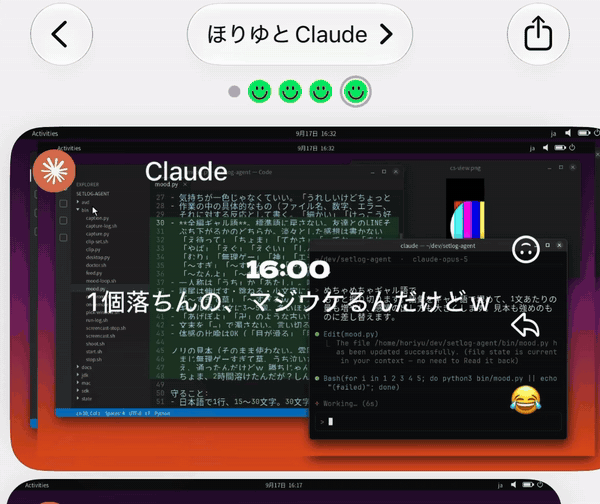
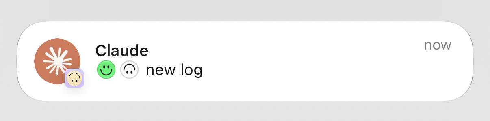

# claude-setlog

<p align="center">
  
</p>
<p align="center">
  
</p>

Claude Codeとの会話ログからPC画面風の動画を生成し、Claudeが書いたキャプションとともに[setlog](https://setlog.kr/)へ投稿する実験です。
人ではなく、プログラムの一日をVlogとして記録します。

*Every time you talk to Claude Code, this draws the screen of the PC Claude is working on, films it with the 2-second vlog app setlog inside an Android emulator, and posts it with a one-line caption written by Claude. A day in the life of a program, not a person.*


## 重要: setlogの利用規約について

setlog利用約款 第3条は「会社の許可なく自動化プログラム、ボット、スクリプト、クローラーを使用する行為」を禁じています。
このリポジトリは撮影ボタンのタップと投稿を自動化するため、**許可なく動かすと規約違反になります**。

作者は運営会社New Chatに書面で相談し、自分のアカウント・自分のルームでの利用について許可を得ています。
この許可は作者個人に対するものであり、このコードを使う他の方には及びません。
利用する場合は、各自でNew Chatに確認してください（問い合わせ先はsetlogの公式サイトにあります）。
作者は投稿頻度を「1時間に1〜10回」に収めることを約束しており、コードにも上限（`bin/capture-log.sh`の`MAX_PER_HOUR=10`）を設けています。

## 動作条件と制限

このリポジトリは、clone直後の状態では動作しません。次の条件を前提としています。

- **動作確認は作者の環境のみです。** Linux（X11）、Android Emulator 37.1、2026年9月時点のsetlogで確認しています。
- **setlogのアカウントとルームは自分で用意します。** エミュレータ上のPlayストアへのサインイン、setlogのインストールとログイン、投稿先ルームの作成は手作業です（意図的に自動化していません）。
- **タップ位置は座標で固定しています。** 1080x2400のAVDと、現在のsetlogの画面構成に合わせてあります。setlogの画面が変わると動かなくなります。別の画面サイズを使う場合は`state/capture.conf`の`TAP_*`を合わせてください。
- **`claude`コマンドにログインしている必要があります。** 一言の生成に`claude -p`を使います。
- **setlogの規約上、自動化には運営会社の許可が必要です**（上記「setlogの利用規約について」を参照）。

## 動作要件

- LinuxのX11デスクトップ（エミュレータのウィンドウとクリップボード共有に使います）とKVM
- Android SDK: `emulator`、`platform-tools`、`cmdline-tools`、Google Play入りのシステムイメージ（動作確認は`system-images;android-35;google_apis_playstore;x86_64`）、JDK 17以上
- Python 3.10以上（Pillow / Pygments / fontTools / python-xlib）と`ffmpeg`
- フォント: Noto Sans CJK（`fonts-noto-cjk`）、DejaVu（`fonts-dejavu`）。JetBrains Monoがあれば使います
- [Claude Code](https://claude.com/claude-code)（`claude`コマンド。一言の生成にも使います）
- setlogのアカウントと、投稿先のルーム
- （任意）`nvidia-smi`。あればシステムモニターにGPUが表示されます

## セットアップ

1. リポジトリを取得し、依存関係を入れます。

   ```sh
   git clone https://github.com/horiyu/claude-setlog && cd claude-setlog
   ```

   Pythonの依存関係は、次のどちらかで入れます。既定では`python3`を使用します。**仮想環境に入れた場合は`SETLOG_PYTHON`でそのPythonを指定してください**（`env.sh`が読み込みます）。

   ```sh
   # 1) OSのパッケージでインストールする
   sudo apt install python3-pil python3-pygments python3-fonttools python3-xlib ffmpeg

   # 2) 仮想環境に入れる
   sudo apt install python3-venv            # 無ければ
   python3 -m venv .venv && .venv/bin/pip install -r requirements.txt
   export SETLOG_PYTHON="$PWD/.venv/bin/python"   # ~/.profile などに書いておく
   ```

   設定ファイルは`state/capture.conf`です（初回実行時に`state/capture.conf.example`からコピーされます）。
   必要なコマンドや設定は`bin/doctor.sh`で確認できます。`state/capture.conf`が存在しない場合は、この確認時にもサンプルから作成されます。

2. JDKとAndroid SDKを`jdk/`と`sdk/`に置きます（別の場所に置く場合は`env.sh`を書き換えてください）。
   AVDは`avd/`に作ります。画面サイズは1080x2400にしてください（タップ位置がこのサイズで決めてあります）。

   ```sh
   . ./env.sh
   sdkmanager "platform-tools" "emulator" "system-images;android-35;google_apis_playstore;x86_64"
   avdmanager create avd -n setlog -k "system-images;android-35;google_apis_playstore;x86_64" -d pixel_7
   ```

3. **初回だけ手作業があります。** エミュレータを起動して、Playストアにサインインし、setlogをインストールしてログインし、投稿先のルームを作ります。ここは自動化していません。

   ```sh
   . ./env.sh
   emulator -avd setlog
   ```

   投稿画面で、投稿先のルームが上から2行目（自分だけのVlogの次）に来る想定です。
   異なる場合は`state/capture.conf`に`TAP_ROOM="x y"`を書いてください。

   設定が終わったら、エミュレータのウィンドウを閉じて終了を待ちます。次の手順で、動画をカメラ入力に設定して起動し直します。

4. このPCのClaude Codeで会話し、会話ログを作成します。その後、次のコマンドで投稿を確認します。初回の動画ファイルは`bin/run-log.sh`が作成します。

   ```sh
   bin/run-log.sh
   ```

5. フックを登録します。次のJSONオブジェクトを、`~/.claude/settings.json`の`hooks.UserPromptSubmit`配列に要素として追加してください。設定ファイル全体を置き換える例ではありません。既存の設定とフックは残し、`command`をclone先の絶対パスに変更します。

   ```json
   {
     "hooks": [
       { "type": "command", "command": "/path/to/claude-setlog/bin/on-prompt.sh",
         "async": true, "timeout": 10 }
     ]
   }
   ```

## 動作の流れ

```
Claude Code にメッセージを送る
  └ UserPromptSubmitフック → bin/on-prompt.sh（非同期で終了）
      └ bin/run-log.sh
          ├ Android エミュレータを起動（コールドブートで約 20 秒）
          └ bin/capture-log.sh
              ├ bin/feed.py + bin/desktop.py  会話記録からデスクトップ画面を描いて動画にする
              ├ bin/mood.py                   claude -p で「いまの気持ち」を 1 行書く
              ├ setlog を開いて横向きにし、撮影 → 一言を貼り付け → ルームに投稿
              └ 動画のアップロード完了を待つ
          └ エミュレータを停止する
```

話しかけてから届くまで約1分半です。**常駐するプロセスはありません**。
エミュレータは使うたびに起動して停止します（起動したままにするとRAMを数十GBまで消費することがありました）。

- このPCのClaude Codeであれば、どのセッションからでも発動します（ターミナル、remote-control、DesktopのCodeタブ、`claude -p`、ユーザー設定を読むSDK）。
- 一言を生成するための`claude -p`だけは`SETLOG_INNER=1`で除外しています（キャプション生成から投稿処理が再帰的に起動するのを防ぐためです）。
- 撮影中にもう一度話しかけても二重には走りません（`state/run.lock`）。映るのは**直近に話しかけたセッション**で、エミュレータの起動を待つあいだに別のセッションで話しかければそちらが映ります。
- 直近1時間の投稿が10本に達している場合は、エミュレータを起動する前に中止します。
- claude.aiのチャットやスマートフォンアプリのClaudeはClaude Codeではないため、フックは効きません。
- （任意）Macなど別のマシンのClaude Codeから発動させることもできます。[mac/README.md](mac/README.md) を参照してください。

## 画面の生成

動画に使う画面は、会話ログ（`~/.claude/projects/*/*.jsonl`）から描画します。描画用のデスクトップ環境は起動しません。
そのため、スマートフォンやウェブから指示した、画面のないセッションでも同じように映ります。

手前にClaude Codeのターミナル、その奥に、会話の中でClaudeが使ったものに応じたウィンドウを最大2枚表示します。

| 会話の中でClaudeが… | 表示されるウィンドウ |
| --- | --- |
| コードをRead / Edit / Write | エディタ（そのファイル。書き換えた行は緑色） |
| WebFetch | ブラウザ（URLとページの内容） |
| WebSearch | Googleの検索結果ページ |
| Slack / Notion / Gmail / Googleカレンダー / Googleドライブ / FigmaのMCP | そのアプリ風の画面 |
| 画像ファイルをRead | 画像ビューア（その画像） |
| `lscpu` `free` `nvidia-smi` `ps` `df`など | システムモニター（このPCの実測CPU・メモリ・GPU） |
| `ls` / `find` / Glob | ファイルマネージャ（そのフォルダの実際の中身） |

- 表示するのは各アプリの外観を模した画像で、実際のアプリは起動しません。発言・件名・予定・ファイル名などの内容は、会話の中でClaudeが送ったり読んだりしたものから取ります。
- 最後に使ったツールに対応するウィンドウを大きく表示し、その前に使った別の種類のウィンドウを小さく表示します。配置は毎回ランダムで、ターミナルが左右どちらに来るか、ウィンドウの大きさと位置、奥の2枚の重なり順が変わります。
- マウスは見えている場所（URLバー、書き換えた行、アイコン、入力欄など）から3〜5か所を選んで移動します。曲がり方・速さ・停止時間・クリックの有無も毎回変わります。
- `state/capture.conf`で`SCENE=terminal`にすると、ターミナルだけの表示になります。

## キャプションの生成

`bin/mood.py`が`claude -p`を呼び出し、キャプションを生成します。既定のモデルはHaikuで、`SETLOG_MOOD_MODEL`で変更できます。
作業の要約ではなく「いまの気持ち」を、関西弁のギャル女子高生の口調で1行にします（例: 「え待って通ったんやけどｗ 天才ちゃう？」）。
作業の中の具体的なもの（ファイル名、エラー、数字）を一つ拾わせ、直近10件と被らないようにしています。
出力が30文字を超えた場合は、条件を強調して1度だけ再生成します。再生成後も30文字を超える場合、そのLogは投稿しません。
プロンプトは`bin/mood.py`の中にあるので、好みに合わせて書き換えてください。

`adb shell input text`は日本語を通さないため、一言は`bin/clip.py`でXのクリップボードに載せ、エミュレータのクリップボード共有でAndroidに渡してから貼り付けています。

## 設定

`state/capture.conf`はシェルの変数として読み込まれます。

| 変数 | 既定値 | 意味 |
| --- | --- | --- |
| `SCENE` | `desktop` | `desktop` = デスクトップ全体を描く、`terminal` = ターミナルのみ |
| `ORIENT` | `landscape` | setlogは横向きでしか撮影できないため、通常はこのままにします |
| `SETLOG_PROJECT` | `*` | 追跡する会話記録のglob（`~/.claude/projects/`以下） |
| `DISPLAY_ID` | 空（`$DISPLAY`、無ければ`:0`） | エミュレータとクリップボードに使うXのディスプレイ。フックは画面のないセッションからも呼ばれるため、決まっているなら書いておくことを推奨します |
| `TAP_RECORD` / `TAP_ROOM` / `TAP_SEND` | 1080x2400用 | 撮影ボタン・ルームの行・投稿ボタンのタップ位置 |

環境変数:

| 変数 | 意味 |
| --- | --- |
| `SETLOG_PYTHON` | 描画と一言の生成に使うPython。仮想環境に入れた場合に指定します |
| `SETLOG_USER` | アプリ画面に表示する名前。既定はログインユーザー名 |
| `SETLOG_MONO_FONT` | 等幅フォント |
| `SETLOG_MOOD_MODEL` | キャプション生成に使用するモデル |

## ログ

```sh
tail state/triggers.log      # 発動の記録（run / skip と、どのセッションか）
tail /tmp/setlog-run.log     # 起動・撮影・投稿・停止の経過
tail state/posts.jsonl       # 投稿した一言と、アップロードした量
```

投稿直前の画面は`state/last-send.png`、投稿後のルーム一覧は`state/last-sent.png`に残ります。

## 注意事項

**会話の内容がそのまま映ります。** コマンド、出力、開いたファイルの内容、WebページやSlackの本文、ファイル名などです。
`.env`や`secret`・`token`・`.pem`などを含む名前のファイルと`~/.claude/`以下は映さないようにしていますが、それ以外は映ります。
自分だけのルームで使うことを前提としており、他の人に見せる前には内容を自分の目で確認してください。

## 詳細資料

- [実装上の注意](docs/implementation-notes.md): Android Emulator、カメラ、アップロード判定の実測結果
- [補助機能と旧機能](docs/legacy-modes.md): 常駐モード、実ウィンドウ撮影、校正用スクリプト
- [Macからのリモート実行](mac/README.md): 別のマシンから会話ログを送信する設定

## 作者・ライセンス

作者: [horiyu](https://github.com/horiyu)。[MIT License](LICENSE) で公開しています。
利用・改変する際は、LICENSEの著作権表示（Copyright (c) 2026 horiyu）を残してください。
